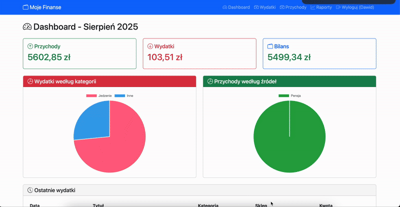

# Website-Finance
Personal web app for tracking incomes and expenses. Built with Django, PostgreSQL and Bootstrap.

Demo image:
<p align="center">
  
</p>

## Features
- Track expenses and incomes by date, category/source and store
- Monthly totals and basic reports
- User accounts (login/register/logout)
- REST endpoints for records (authenticated)
- Static assets served via WhiteNoise (in Docker)

## Tech stack
- Python 3.11, Django 5
- PostgreSQL 15
- Bootstrap 5
- Docker + Docker Compose
- Gunicorn (prod-like run in Docker)

## Quick start (Docker, recommended)
Prerequisites:
- Docker and Docker Compose installed

1) Create .env in the project root:
```dotenv
SECRET_KEY=change-me
DEBUG=1
ALLOWED_HOSTS=localhost,127.0.0.1,0.0.0.0

# Database connection used by Django (settings.py should read these)
DB_NAME=finance_db
DB_USER=finance
DB_PASSWORD=1234
DB_HOST=db
DB_PORT=5432
```

2) Start the stack:
```bash
docker compose up -d --build
```
- App: http://localhost:8000
- DB (Postgres): exposed on localhost:5433 (mapped to container 5432)

3) Create an admin user:
```bash
docker compose exec web python manage.py createsuperuser
```

The web service runs:
- Migrations: python manage.py migrate
- Collect static: python manage.py collectstatic --noinput
- Server: gunicorn --bind 0.0.0.0:8000 config.wsgi:application

## Local development (live reload)
For Django auto-reload during development you can temporarily run the dev server instead of Gunicorn:
```bash
# Option A: one-off run (stops when you close it)
docker compose run --service-ports --rm web python manage.py runserver 0.0.0.0:8000
```
Or add a docker-compose.override.yml in the project root to always use runserver during dev:
```yaml
services:
  web:
    command: sh -c "python manage.py migrate && python manage.py runserver 0.0.0.0:8000"
    ports:
      - "8000:8000"
    environment:
      - DEBUG=1
    volumes:
      - .:/app
```
Then run:
```bash
docker compose up --build
```

## Project structure (simplified)
```
Website-Finance/
├─ config/                # Django project (settings, urls, wsgi)
├─ finance/               # App with views, models, templates, static
│  ├─ templates/finance/  # Django templates
│  └─ static/             # Static assets (e.g., css/style.css)
├─ accounts/              # Auth related app
├─ manage.py
├─ Dockerfile
├─ docker-compose.yml
└─ .env
```

## Environment variables
Required at minimum:
- SECRET_KEY: Django secret key (use a strong, unique value in production)
- DEBUG: 1 for development, 0 for production
- ALLOWED_HOSTS: comma-separated list (include your domain/IP in prod)

Database variables expected by settings (example):
- DB_NAME, DB_USER, DB_PASSWORD, DB_HOST, DB_PORT

Note: Ensure your config/settings.py reads these variables to configure DATABASES.

## Troubleshooting
- Page not loading: run docker compose logs -f web and docker compose logs -f db
- Static files not styled: confirm collectstatic ran and DEBUG/WhiteNoise configuration is correct
- Cannot connect to DB: ensure DB_HOST=db and DB_PORT=5432 in .env when using Docker

## Deployment notes (Raspberry Pi)
- This project runs on ARM via Docker (Postgres 15-alpine and Python slim images support ARM)
- You can automate hourly updates using a cron job that runs git pull and docker compose up -d --build

## License
MIT (or your preferred license)
